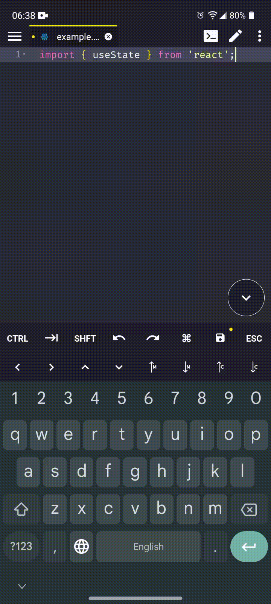

<h2 align='center'>:iphone: Acode Snippets :iphone:</h2>

   
  
   
   

## :pushpin: Requirements: :pushpin:

Acode: :link: https://play.google.com/store/apps/details?id=com.foxdebug.acodefree&pcampaignid=web_share

---
:exclamation: 
<h2>To use these snippets, in the editor go to: Settings > Plugins > Snippets > (Click on the extension's gear) > Set Snippets Directory > And select this folder with the snippets.</h2>

* CSS.
* HTML.
* JavaScript.
* JSX.
* TypeScript.
